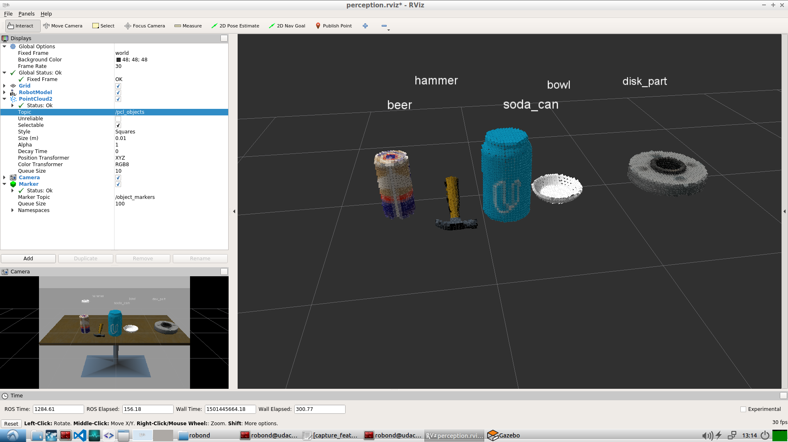
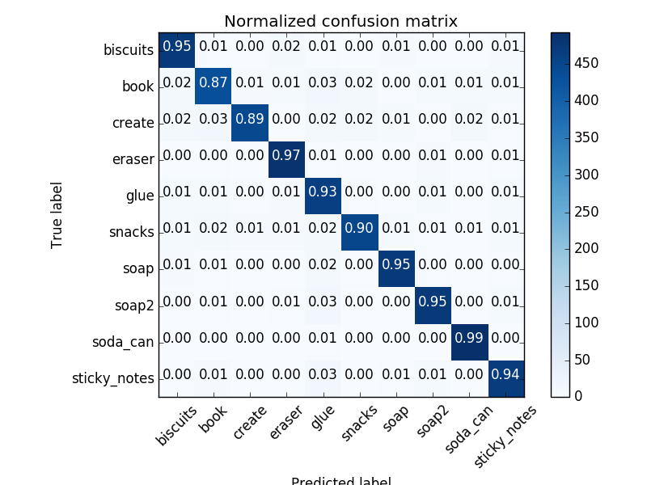
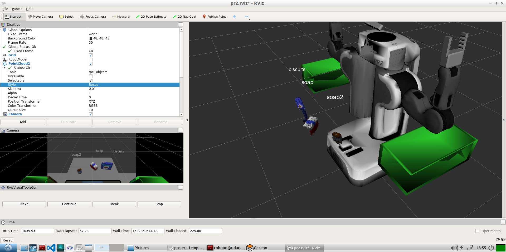
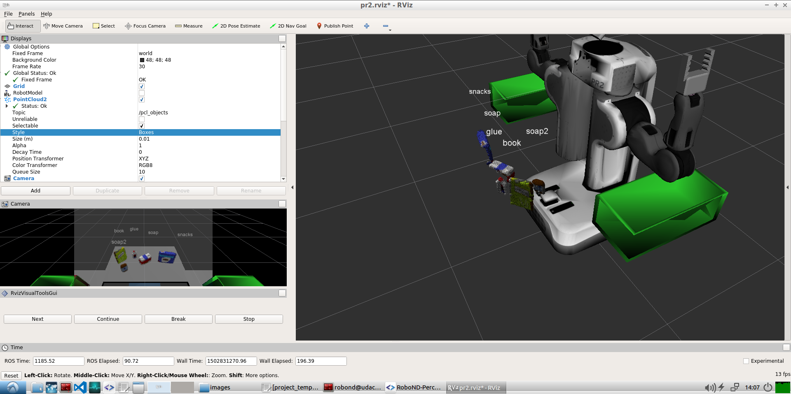
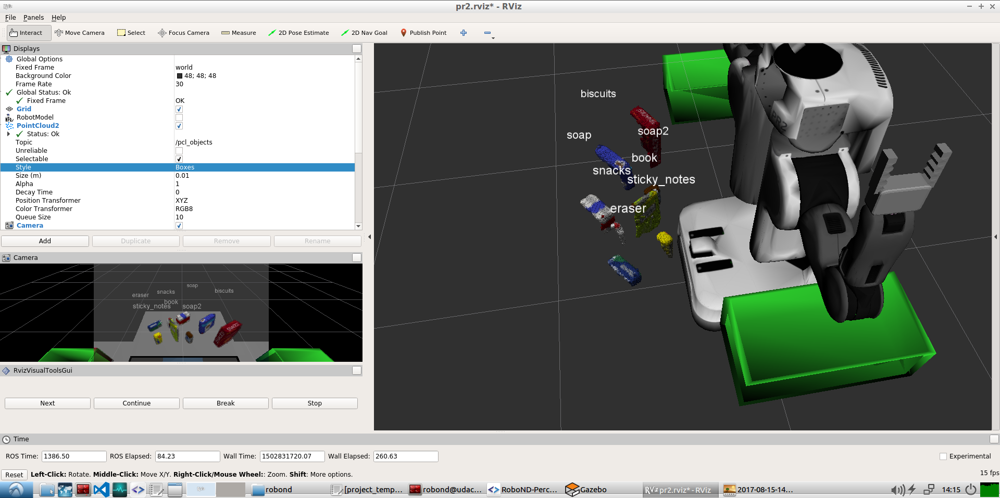

This is the writeup for Udacity RoboND Perception project.

### Exercise 1, 2 and 3 pipeline implemented
#### 1. Complete Exercise 1 steps. Pipeline for filtering and RANSAC plane fitting implemented.
Here is a sample code implementing RANSAN Plane Segmentation filtering.
```python
# Create a Segmenter Object, set it to fit a Plane model using RANSAC method.
seg = cloud_filtered.make_segmenter()
seg.set_model_type(pcl.SACMODEL_PLANE)
seg.set_method_type(pcl.SAC_RANSAC)

# Extract the points fitted by the Segmenter
max_distance = 0.01
seg.set_distance_threshold(max_distance)
inliers, coefficients = seg.segment()

# Extract the Table Cloud as inliers and Objects Cloud as outliers
cloud_table = cloud_filtered.extract(inliers, negative=False)
cloud_objects = cloud_filtered.extract(inliers, negative=True)
```

#### 2. Complete Exercise 2 steps: Pipeline including clustering for segmentation implemented.  
Sample code for implementing Eucclidean Clustering with inline comments.
```python
# Convert the object cloud to a white cloud and make Kd Tree.
white_cloud = XYZRGB_to_XYZ(cloud_objects)
tree = white_cloud.make_kdtree()

# Apply Euclidean Clustering.
ec = white_cloud.make_EuclideanClusterExtraction()
ec.set_ClusterTolerance(0.05)
ec.set_MinClusterSize(50)
ec.set_MaxClusterSize(2000)

# Extract cluster indices for separate clouds.
ec.set_SearchMethod(tree)
cluster_indices = ec.Extract()
```

#### 2. Complete Exercise 3 Steps.  Features extracted and SVM trained.  Object recognition implemented.
```python
# Extract histogram features from the ROS point cloud
chists = compute_color_histograms(ros_cluster, using_hsv=True)
normals = get_normals(ros_cluster)
nhists = compute_normal_histograms(normals)                        

# Compute the associated feature vector
feature = np.concatenate((chists, nhists))

# Make the prediction, retrieve the label for the result
# and add it to detected_objects_labels list
prediction = clf.predict(scaler.transform(feature.reshape(1,-1)))
label = encoder.inverse_transform(prediction)[0]
```

Here are the methods used for histogram computation,
```python
def compute_color_histograms(cloud, using_hsv=False):

    # Compute histograms for the clusters
    point_colors_list = []

    # Step through each point in the point cloud
    for point in pc2.read_points(cloud, skip_nans=True):
        rgb_list = float_to_rgb(point[3])
        if using_hsv:
            point_colors_list.append(rgb_to_hsv(rgb_list) * 255)
        else:
            point_colors_list.append(rgb_list)
            
    # Populate lists with color values
    channel_1_vals = []
    channel_2_vals = []
    channel_3_vals = []

    for color in point_colors_list:
        channel_1_vals.append(color[0])
        channel_2_vals.append(color[1])
        channel_3_vals.append(color[2])
    
    nbins = 32
    bins_range = (0, 256)            
        
    # TODO: Compute histograms
    hist_1 = np.histogram(channel_1_vals, bins=nbins, range=bins_range)
    hist_2 = np.histogram(channel_2_vals, bins=nbins, range=bins_range)
    hist_3 = np.histogram(channel_3_vals, bins=nbins, range=bins_range)


    # TODO: Concatenate and normalize the histograms
    hist_features = np.concatenate((hist_1[0], hist_2[0], hist_3[0])).astype(np.float64)

    norm_features = hist_features*1.0 / np.sum(hist_features)
     
    return norm_features 

def compute_normal_histograms(normal_cloud):
    norm_x_vals = []
    norm_y_vals = []
    norm_z_vals = []

    for norm_component in pc2.read_points(normal_cloud,
                                          field_names = ('normal_x', 'normal_y', 'normal_z'),
                                          skip_nans=True):
        norm_x_vals.append(norm_component[0])
        norm_y_vals.append(norm_component[1])
        norm_z_vals.append(norm_component[2])
        
    # TODO: Compute histograms of normal values (just like with color)
    nbins = 32
    bins_range = (-1, 1)
    hist_1 = np.histogram(norm_x_vals, bins=nbins, range=bins_range)
    hist_2 = np.histogram(norm_y_vals, bins=nbins, range=bins_range)
    hist_3 = np.histogram(norm_z_vals, bins=nbins, range=bins_range)

    # TODO: Concatenate and normalize the histograms
    hist_features = np.concatenate((hist_1[0], hist_2[0], hist_3[0])).astype(np.float64)

    norm_features = hist_features*1.0 / np.sum(hist_features)

    return norm_features
```

So, we get the following result when running with the above parameters on the Exercise world.


And, this is the confusion matrix that we get by using **500** poses for each of the objects used in `pick_list_*.yaml` files.


### Pick and Place Setup

#### 1. For all three tabletop setups (`test*.world`), perform object recognition, then read in respective pick list (`pick_list_*.yaml`). Next construct the messages that would comprise a valid `PickPlace` request output them to `.yaml` format.
Firstly, here are the results from running object recognition pipeline on the three worlds.

**World 1 output**



**World 2 output**


**World 3 output**


To get the above results here are some of the high level steps that i followed:
- Created separate Filter functions for all of the filters that take in an `in_cloud`, apply the corresponding filter based on pre defined parameters, optionally dump the filtered cloud and return the filtered cloud. This helped me test various configurations of the filters easily, specifically i tried to apply the statistical outlier removal at different times in the pipeline, and this really helped.
- For the training part, I started with 10 poses per object, which wasn't very good, then I increased it to use 15 poses per object. This actually gave good result (~83%), without any tweekings to the SVM parameters. However, just to see how much accuracy i can acheive with more data, I ran the training data for 500 iterations per object.
- I Also faced issues while creating the yaml messages with data type mismatch. This was resolved by typecasting the relavant numpy arrays to python lists.
- Also tried to implement the challenge part, starting with publishing the collision cloud. For this i merged the `table` with all the objects except the object that the arm needs to pick and published this cloud to `/pr2/3D_map/points` topic.  
- Implemented a function `AddCloud` that takes in two pcl clouds and accumulates them. This helped in implementing the collision cluster.
- So with the current code the arm is able to pick up the objects place them in the relavant box, however i am facing an issue where the the gripper is not properly closing in on the object while picking up. Here is a video link showing the same on the first world.
- Not sure how would rotating the robot head initially help in constructing the collision cloud, as currently i am creating the cloud by accumulating the detected objects. 
- Still trying to improve the code and collision cloud, would appreciate if i can get feedback on the challenge tasks as well.\\

**Click to see the World 1 test video on youtube**
[](https://youtu.be/JHN3Tkpb_Bw)


